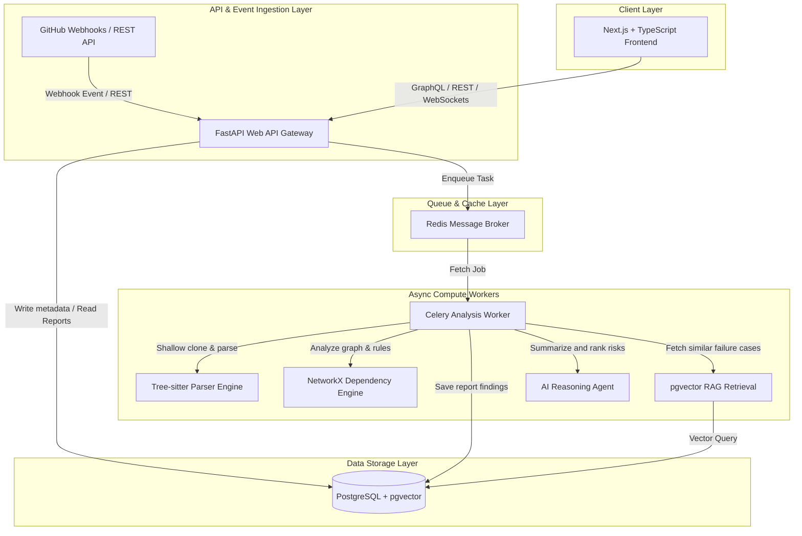
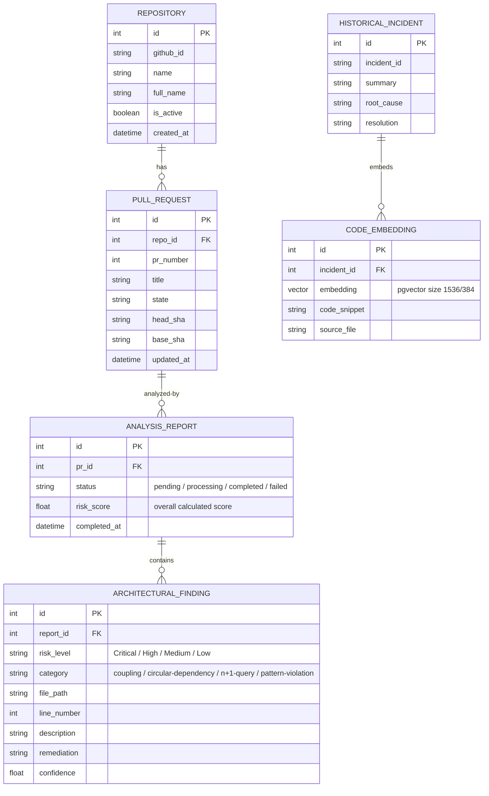
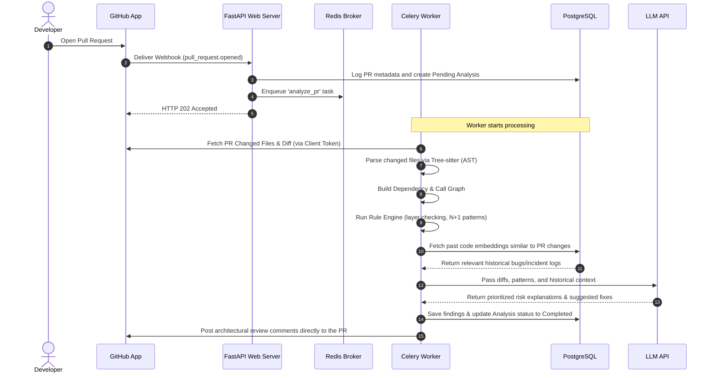

# System Architecture Document: AI Architecture Code Reviewer

This document details the architectural layout, modules, data models, and processing pipelines for the AI Architecture Code Reviewer system.

---

## 1. High-Level Architecture Overview

The system follows a decoupled, async-first **Modular Monolith** architecture. High-latency processes (like cloning code, AST building, graph processing, and LLM reasoning) are delegated to background workers to ensure the FastAPI Web API remains highly responsive.

---

## 2. Component Layout & Module Design

### 2.1 Next.js Frontend
- **Framework**: Next.js (using App Router) + Tailwind CSS + shadcn/ui.
- **Visuals**: Dependency relationships and circular loops visualized via D3.js or Cytoscape.js.
- **WebSockets**: Real-time status update feeds from FastAPI when Celery processes a PR.

### 2.2 FastAPI Backend API
- **Entrypoint**: `app/main.py`
- **Routing**: Separated by functional domain (e.g., `/api/v1/github`, `/api/v1/repositories`, `/api/v1/analysis`).
- **ORM & DB Connection**: SQLAlchemy 2.0 with asyncpg driver for asynchronous connections.

### 2.3 Celery Worker Tasks
- **Clone Task**: Handles repository checkout with shallow cloning (`git clone --depth 1`).
- **AST Parser Task**: Parses files using language-specific Tree-sitter bindings.
- **Analysis Execution**: Evaluates AST structure against predefined rule classes and graph cycles.
- **RAG & Reasoning**: Aggregates metadata, queries vector store for historical bugs, prompts the LLM, and publishes reviews.

---

## 3. Database Schema Design (SQLAlchemy Models)

---

## 4. Architectural Analysis Pipeline Flow

Here is the sequential flow of how a PR undergoes review:

---

## 5. Security & Edge Mitigation Architecture

1.  **Code Isolation**: AST parsing is purely static and does not execute the target codebase. Cloned code is confined to ephemeral scratch paths that are cleaned up inside a `finally:` block.
2.  **Access Token Least Privilege**: GitHub Installation Access Tokens are scoped strictly to the repository being reviewed, with short-lived 1-hour expirations.
3.  **LLM Input Size Management**: PR diffs are filtered to skip dependencies (like `node_modules` or `.venv`) and non-code assets. Code blocks are chunked to fit LLM context lengths.
